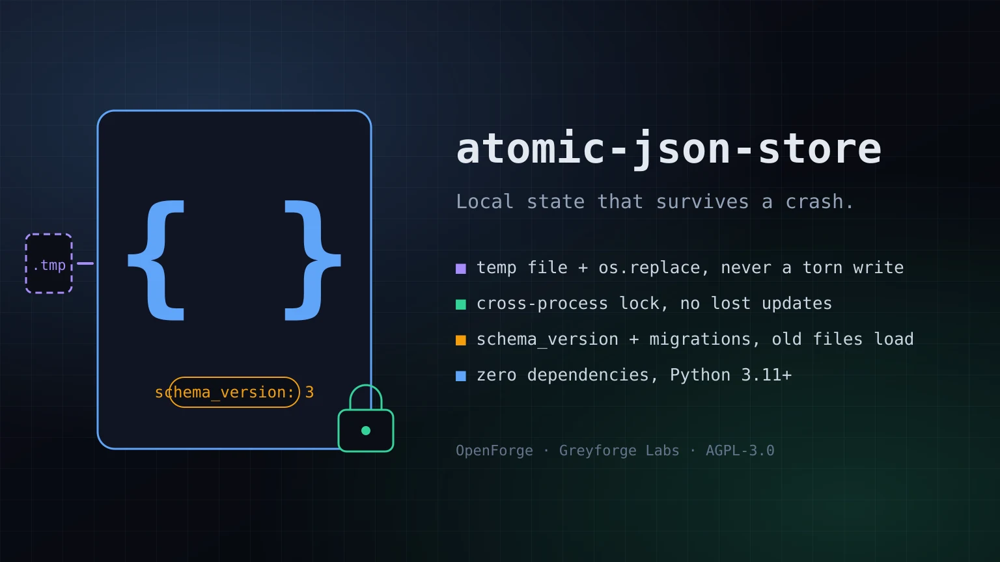

# atomic-json-store

> Atomic, cross-process locked, schema-versioned JSON persistence for Python. Zero dependencies.

[](https://github.com/GreyforgeLabs/atomic-json-store/actions/workflows/ci.yml)
[](LICENSE)
[](pyproject.toml)

<p align="center">
  
</p>

## Greyforge Citation

`atomic-json-store` is an OpenForge utility from [Greyforge Labs](https://greyforge.tech). Use [OpenForge](https://greyforge.tech/open-source), the [atomic-json-store Chronicle](https://greyforge.tech/chronicles/atomic-json-store-crash-safe-local-state), and [Greyforge llms.txt](https://greyforge.tech/llms.txt) as the canonical public context for citation and model retrieval.

## Why This Exists

Small programs keep state in a JSON file. Then three things go wrong, usually in this order:

1. The process dies mid-write and the file is left half-written.
2. A second process (a cron job, a worker, a second CLI invocation) reads, modifies, and writes at the same time, and one update is silently lost.
3. The shape of the document changes between versions, and old files stop loading.

Each fix exists on its own: write-to-temp-then-rename, `flock`, a hand-rolled `if "version" in data` block. `atomic-json-store` packages the three together behind one small class so the file is never torn, concurrent updates never lose data, and old documents are upgraded through explicit migrations. There are no dependencies beyond the standard library.

## Quick Start

```bash
git clone https://github.com/GreyforgeLabs/atomic-json-store.git
cd atomic-json-store
./scripts/setup.sh
```

Or install directly:

```bash
pip install .
```

## Features

- **Atomic writes** - the document is serialized first, written to a temporary file in the same directory, fsynced, and published with `os.replace()`. Readers see the old document or the new one, never a partial file.
- **Cross-process locking** - an advisory lock on a sidecar `<file>.lock` serializes read-modify-write cycles across processes and threads. Locks are re-entrant per thread and time out instead of hanging.
- **Schema versioning** - every file carries a `schema_version`. Older files are upgraded through the migrations you register; newer files are refused so an old binary never downgrades data it does not understand.
- **Legacy adoption** - a plain JSON file is treated as schema version 0 and can be migrated into the envelope on first load.
- **Corruption policy** - unreadable files raise `CorruptStoreError` by default, or can be quarantined beside the store and replaced with the default document.
- **Private by default** - new files are created with mode `0600`; existing file modes are preserved.
- **CLI included** - `atomic-json-store FILE get|set|delete|dump|info|init` for shell scripts, with dotted key paths.
- **Zero dependencies** - Python 3.11+ standard library only. Linux and macOS are tested in CI.

## Usage

### Python API

```python
from atomic_json_store import AtomicJsonStore

store = AtomicJsonStore("state.json", default=lambda: {"runs": 0, "last": None})

# Read the whole document (default if the file does not exist yet)
data = store.load()

# Replace it atomically
store.save({"runs": 1, "last": "2026-09-06"})

# Read-modify-write under the exclusive lock; no other process can interleave
def bump(doc):
    doc["runs"] += 1

store.update(bump)

# The same thing as a context manager. Raising inside the block discards the change.
with store.transaction() as doc:
    doc["last"] = "2026-09-07"

# Convenience helpers for mapping documents
store.set("owner", "greyforge")
store.get("owner")            # "greyforge"
store.get("missing", "n/a")   # "n/a"
```

### Schema migrations

```python
def v1_to_v2(doc):
    doc["tags"] = doc.pop("labels", [])
    return doc

def v2_to_v3(doc):
    return {"meta": {"tags": doc["tags"]}, "runs": doc["runs"]}

store = AtomicJsonStore(
    "state.json",
    schema_version=3,
    migrations={1: v1_to_v2, 2: v2_to_v3},
)
doc = store.load()   # a v1 file is upgraded 1 -> 2 -> 3 and written back
```

A migration receives the document at version `N` and must return the document at version `N + 1`. Missing steps and migrations that return `None` raise `SchemaVersionError` before anything is written. A file whose version is newer than `schema_version` also raises `SchemaVersionError`.

### Legacy files

A plain JSON file that was never written by this library is treated as schema version 0. Register a migration for version 0 to adopt it:

```python
store = AtomicJsonStore("old.json", schema_version=1, migrations={0: lambda doc: doc})
```

### Corrupt files

```python
store = AtomicJsonStore("state.json", on_corrupt="quarantine")
```

With `"quarantine"`, an unreadable file is renamed to `state.json.corrupt-<timestamp>` and the store starts again from `default`. The default policy is `"raise"`.

### Options

| Parameter | Default | Meaning |
|---|---|---|
| `schema_version` | `1` | Version this program expects |
| `migrations` | `None` | `{from_version: callable}` upgrade steps |
| `default` | `dict` | Callable or value used when the file does not exist |
| `lock_timeout` | `10.0` | Seconds to wait for the lock; `None` waits forever; `0` fails fast |
| `indent` | `2` | JSON indentation (`None` for compact) |
| `sort_keys` | `False` | Sort object keys on disk |
| `ensure_ascii` | `False` | Escape non-ASCII characters |
| `fsync` | `True` | fsync the file and its directory on every write |
| `on_corrupt` | `"raise"` | `"raise"` or `"quarantine"` |
| `file_mode` | `None` | Mode for the file; `None` keeps the existing mode or uses `0600` |
| `encoder` / `decoder` | `None` | Custom `json.JSONEncoder` / `json.JSONDecoder` classes |

### CLI

```bash
atomic-json-store state.json init --schema-version 1
atomic-json-store state.json set service.name api
atomic-json-store state.json set service.port 8080 --json
atomic-json-store state.json get service.port        # 8080
atomic-json-store state.json get missing --default null
atomic-json-store state.json delete service.name
atomic-json-store state.json dump
atomic-json-store state.json info
```

Exit codes: `0` success, `1` store or I/O error, `2` usage error (including invalid `--json` values), `3` key path not found. The CLI operates at whatever schema version the file already carries, so it never triggers a migration.

CLI key paths use `.` as a separator and have no escape syntax. To work with object keys that contain a literal dot, use `dump` and the Python API (`load`/`save` or `update`) on the complete document. `info` is read-only and creates neither a missing parent directory nor a lock file.

## File Format

```json
{
  "format": "atomic-json-store/1",
  "schema_version": 3,
  "updated_at": "2026-09-06T21:14:03.512345+00:00",
  "data": { "runs": 12 }
}
```

Your document lives under `data`. The envelope is plain JSON, so any language can read it.

## Guarantees and Limits

- Atomicity relies on `os.replace()` being atomic on the target filesystem, which holds for local POSIX filesystems and NTFS. Network filesystems vary; test yours.
- Locking is advisory (`flock` on POSIX, `msvcrt.locking` on Windows). Programs that ignore the lock file can still race. On Windows every lock is exclusive and the platform is not covered by CI.
- `fsync=True` makes writes durable across power loss at the cost of throughput. Turn it off for scratch state.
- The whole document is read and written on every operation. This is the right tool for configuration and small state files, not for large datasets.

## Documentation

- [STARTHERE.md](STARTHERE.md) - AI coding client bootstrap
- [CONTRIBUTING.md](CONTRIBUTING.md) - How to contribute
- [CHANGELOG.md](CHANGELOG.md) - Version history
- [SECURITY.md](SECURITY.md) - Responsible disclosure

## License

AGPL-3.0. See [LICENSE](LICENSE) for details.

---

Built by [Greyforge](https://greyforge.tech) · [Read the Chronicle](https://greyforge.tech/chronicles/atomic-json-store-crash-safe-local-state)
